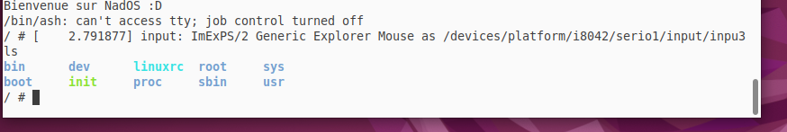
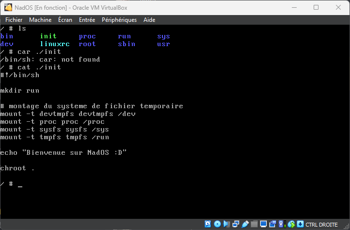

# NadOS (Défis personnel)

## NadOS est un kernel compilé avec les outils busybox, l'idée m'est venu en voyant le dépôt de TEDDAC/BorvOS

Mon but étant de mieux comprendre le noyaux linux et le chargement d'un système d'exploitation en général

-----------------------
## Sources
- https://github.com/TEDDAC/BorvOS --> Inspiration
- https://busybox.net/ --> 1.33.2
- https://kernel.org/ --> 6.0.9
-----------------------

## Arborescence du projet
- `kernel`: noyau linux 6.0.9 compilé
- `ramdisk`: fichier binaire nécessaire au chargement du noyau
- `nados.iso`: fichier ISO bootable contenant le projet compilé
- `init`: fichier se lancant au démarrage du noyau
- `grub.cfg`: configuration du bootloader GRUB pour le chargement du noyau dans la RAM
- `rootbuild.tar`: fichier compressé contenant la racine du système


## Boot avec qemu
```
$ qemu-system-x86_64 -m 2048 -kernel ./kernel -initrd ./ramdisk -nographic -append "console=ttyS0"
```
---------------------

## Problèmes actuels
Pour le moment le boot avec qemu à l'air de bien fonctionner. Cependant le boot via l'image ISO sur VirtualBox a des soucis de montages


